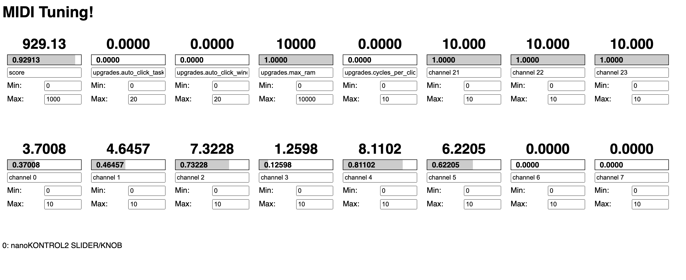

# Unnamed Web-Based MIDI Tuning Tool

This is a tool to help you tune your game's constants and magic numbers using a [Korg NanoKontrol 2](https://www.amazon.com/Korg-nanoKONTROL2-Slim-Line-Control-Surface/dp/B004M8UZS8) MIDI controller.

Not sure why you'd want that? [This 10-minute video](https://www.youtube.com/watch?v=stM33UcLPJ0) may be a useful introduction.



This is a web-based tool. When you you load up the tool in your web browser (by running a local web server), it connects to a MIDI controller connected over USB via WebMIDI (currently hardcoded to expect the number of inputs and channel numbers that a NanoKontrol 2 sends). For each of your controller's inputs, if you give that input a name/key and min/max values (representing what the lowest and highest outputs of that knob/slider should be mapped to), the web app will broadcast any changes over a WebSocket connection.

In your game, if you connect to the local web server that's hosting the web app over WebSockets, you will receive updates any time one of those values is updated. You can write your own code to interpret that data and change your game's internal state or constants based on what you receive.

Using Unity to work on a game you can run in Play mode? My library [GroundKontrol](https://github.com/lazerwalker/groundkontrol) may be more helpful to you.

## Server Setup

1. Make sure you have [Node.js](https://nodejs.org/en/) installed
2. Clone this git repo: `git clone https://github.com/lazerwalker/midi-tuner.git`
3. Within the project directory, run `npm install`. This will install the dependencies needed to run this app
4. Still within the project directory, run `npm run server`. This will start up the local web server, which both hosts the web app and a WebSocket server
5. Go to https://localhost:3000 in your web browser. Safari is not supported. You should have a working webapp!

## Client Setup

1. Find the IP address of the computer running the server. On Windows, open a Command Prompt and run `ipconfig`. On a Mac, run `ipconfig getifaddr en0` for WiFi, or `en1` for wired ethernet
2. Within your game, open a WebSocket connection to `ws://[server IP]:3000`. How to do this will depend on your game engine. [NativeWebSocket](https://github.com/endel/NativeWebSocket) is a decent option if you're using Unity
3. Each WebSocket message will be of the form `key=value`, where `key` is a string you will define in the webapp for a given input, and `value` will be a floating-point number calculated by interpolating between min and max values you specify in the webapp based on MIDI input. As long as you are okay with not using `=` as a character in your key, you can naively split that string on the `=` character to get your key and value. In JavaScript, this might look like `const [key, value] = message.split("=")`.

You can see working JS sample code for connecting to the WebSocket server and parsing messages [here](https://github.com/lazerwalker/idle-prototypes/blob/main/src/midiTuner.ts) (this code is using React and the Flux architecture — the `dispatch` function triggers an adjustment of a global state object)

## Using the Tool

The web app interface has 16 tiles, representing the NanoKontrol 2's 8 potentiometers and 8 sliders. Each one lets you enter a name/key, which is passed through any time that input's value changes. It also has a `min` and a `max`.

When an input's value is changed, the value sent across the network is calculated based on the input's raw value, min, and max based on the formula `min + (max - min) * input` (where the raw `input` from the MIDI controller is a number between 0.0 and 1.0). In other words, if you set `min` to `5` and `max` to `100`, a slider/knob being set to 0 will result in an output of 5, while moving it to its maximum position will send `100`.

While you could write code that maintains a manual mapping between WebSocket keys and where those objects live in your state, I recommend using something such as keypaths to programmatically traverse nested objects.

As an example, if your game has a data structure looks like:

```json
{
  "mario": {
    "jump": {
      "airAcceleration": 10,
      "airControl": 5,
      "airBrake": 10,
      "maxHeight": 4,
      "risinggGravity": 4,
      "fallingGravity": 20
      ...
    }
    ...
  },
  "luigi": {
    "jump": {
      "airAcceleration": 7,
      "airControl": 5,
      "airBrake": 10,
      "risinggGravity": 4,
      "fallingGravity": 17
      ...
    }
    ...
  },
}
```

In this situation, you may find it helpful to set your keys to e.g. `mario.jump.fallingGravity` and then have your game logic that handles WS messages do a keypath search within your state object to turn that into the ability to modify `mario["jump"]["fallingGravity"]`. Your programming language likely either has libraries on GitHub or sample code on StackOverflow to do that effectively, as using keypaths are a common abstraction for modifying nested data like this.

Part of the joy of this sort of MIDI tuning approach is being able to change on-the-fly what variables you're even attempting to tune, which means it's worth being able to just whimsically change an input to `mario.jump.airBrake` or `luigi.jump.fallingGravity` without having written code ahead of time to handle those keys. (If you're using my Unity library I linked earlier instead of this web app tool, you'll be able to dynamically get a list of properties you can set on your live scene objects, which is even cooler!)

### Caveats and More

This is currently a very janky project, intended for my specific use. You get what you pay for. If you're not using a Korg NanoKontrol 2, you'll likely need to futz with the mapping of what controls get rendered in `client.ts` and possibly what MIDI values to listen for in `midi.ts`. If you're not used to running a node.js server or connecting to a websocket server from your game, good luck and Google is your friend.

This repo is very much "open source" in the sense of "I dumped my live code repo on GitHub", rather than "I have spent time and effort crafting a well-designed design tool for others to integrate into their projects". I'm hoping I'll have time to clean this up into something a bit more friendly, but I can make no promises for now. Similarly, you're welcome to open issues and PRs, but I can't make any promises for anything more complex than "you have a typo in the README".

### License

MIT License, see LICENSE.md
